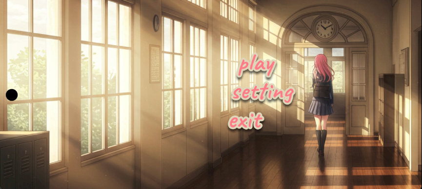
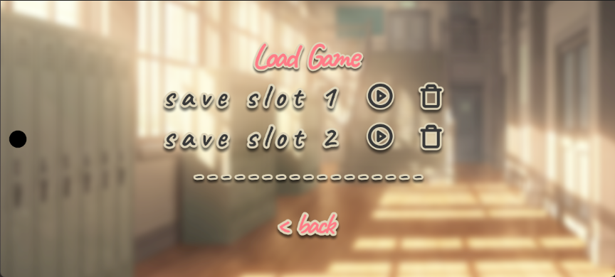
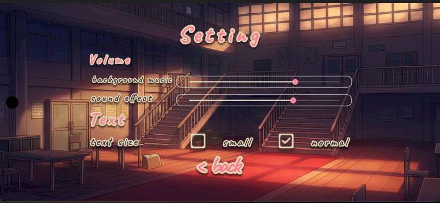
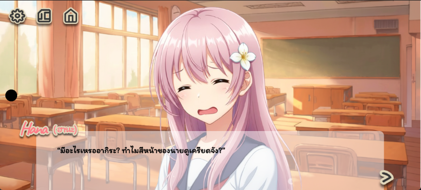
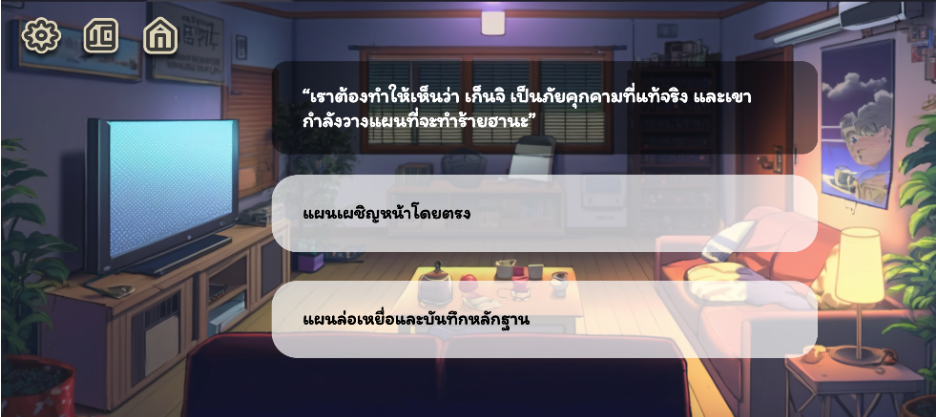

# 🌸 BeyondHana

**BeyondHana** คือเกม Visual Novel ที่พัฒนาด้วย .NET MAUI เพื่อให้ทุกคนได้สัมผัสประสบการณ์การเล่าเรื่องแบบอินเทอร์แอคทีฟในรูปแบบภาษาไทย พร้อมอินเทอร์เฟสภาษาอังกฤษสำหรับผู้เล่นต่างชาติ

โปรเจกต์นี้เริ่มต้นจากทีมงานขนาดเล็กที่ต้องการสร้างเกมเนื้อเรื่องภาษาไทยที่เข้าถึงง่ายบนแพลตฟอร์มสมัยใหม่

---

## 💡 เกี่ยวกับโปรเจกต์

- 🚀 พัฒนาโดยใช้ **.NET MAUI** (บน .NET 9) มีศักยภาพในการขยายสู่หลายแพลตฟอร์ม (ขณะนี้รองรับ Android)
- 🌐 **อินเทอร์เฟสเกมเป็นภาษาอังกฤษ** แต่ **เนื้อเรื่องทั้งหมดเป็นภาษาไทย**
- 📖 เกมดำเนินเรื่องผ่านภาพและข้อความ พร้อมระบบตัวเลือกที่ส่งผลต่อเนื้อเรื่องและตอนจบ

---

## 👥 ทีมผู้สร้าง

- ✍️ **เนื้อเรื่อง** โดย [Cariel](https://github.com/Cariel22) — เขียนเรื่องราวและบทสนทนา  
- 🎮 **ออกแบบเกม & ดนตรี** โดย [Beconet](https://github.com/Beconet) — ดูแลระบบการเล่นและสร้างสรรค์ประสบการณ์เสียง  
- 💻🎨 **โปรแกรมมิ่ง & ดีไซน์แอป** โดย [etsuwithtea](https://github.com/etsuwithtea) — พัฒนา ดูแลโค้ด และออกแบบแอปพลิเคชัน  

---

## ✨ ฟีเจอร์เด่น

- 📝 อินเทอร์เฟสภาษาอังกฤษ เข้าใจง่ายสำหรับผู้เล่นนานาชาติ
- 🇹🇭 เนื้อเรื่องและบทสนทนาเป็นภาษาไทยทั้งหมด
- 🔀 ระบบตัวเลือก (Choice) ที่เปลี่ยนเส้นเรื่องและจุดจบได้หลายแบบ
- 🖼️ ภาพประกอบและ UI ออกแบบเฉพาะสำหรับประสบการณ์ Visual Novel
- 📱 รองรับการขยายสู่หลายแพลตฟอร์ม (ขณะนี้เล่นได้บน Android)

---

## 🖼️ ภาพตัวอย่างเกม










---

## 🛠️ วิธีเริ่มต้น

1. ดาวน์โหลดและติดตั้ง [.NET 9 SDK](https://dotnet.microsoft.com/en-us/download/dotnet/9.0) หรือใหม่กว่า  
2. ติดตั้ง MAUI workload ด้วยคำสั่ง  
   ```
   dotnet workload install maui
   ```
3. โคลนโปรเจกต์นี้  
   ```
   git clone https://github.com/etsuwithtea/BeyondHana.git
   ```
4. เปิดโปรเจกต์ด้วย Visual Studio 2022 หรือใหม่กว่า (ที่รองรับ .NET MAUI และ .NET 9)  
5. สั่งรันโปรเจกต์ โดยแนะนำให้เลือกแพลตฟอร์ม Android  

---

## 📦 ดาวน์โหลดตัวเกม (APK)

[ดาวน์โหลด BeyondHana สำหรับ Android (APK)](https://drive.google.com/file/d/1VfXy8sLSWQXipPHKdmSGPbOwaiPn-FH0/view?usp=sharing)

---

## ⚠️ หมายเหตุ

- โปรเจกต์ยังอยู่ระหว่างการพัฒนา อาจมีการเปลี่ยนแปลงเนื้อหาและฟีเจอร์ในอนาคต
- หากพบปัญหาหรือมีข้อเสนอแนะ สามารถแจ้งผ่าน Issue ใน GitHub Repository นี้

---

ขอบคุณทุกท่านที่ติดตามและสนับสนุน 🌸 **BeyondHana**
